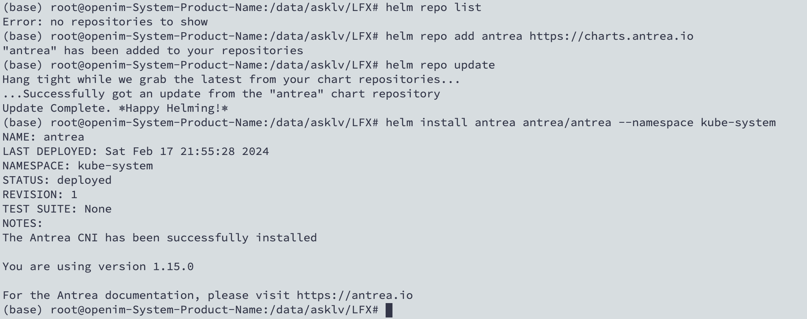
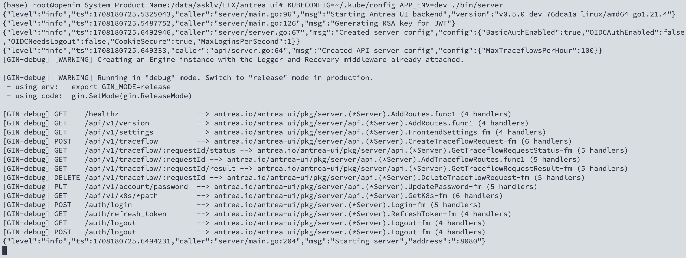
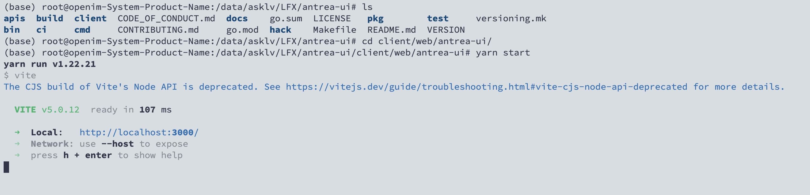
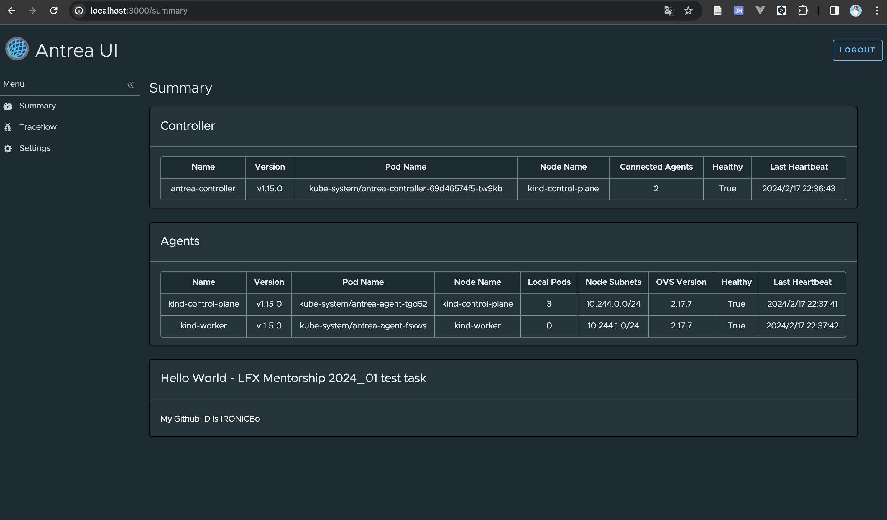

# LFX Mentorship 2024_01 test task

### 1. Install Antrea using Helm

Install helm and add antrea repo.



**Reference**
- Install with helm: https://github.com/antrea-io/antrea/blob/main/docs/helm.md#prerequisites

### 2. Run frontend and backend

Build project with make, and use `KUBECONFIG` to reach endpoint.

```bash
make bin
KUBECONFIG=~/.kube/config APP_ENV=dev ./bin/server
```



Try to install node(version 18) and install yarn to run web page.

```bash
npm install --global n
n 18
npm install --global yarn
yarn install
yarn start
```



**Reference**
- https://github.com/antrea-io/antrea-ui/blob/main/CONTRIBUTING.md#running-the-ui-locally

### 3. Modify and refresh browser

Add card in `antrea-ui/client/web/antrea-ui/src/routes/summary.tsx` and save it.



### Problems here

I encountered an issue where the work nodes are unable to join the cluster and throw errors. Eventually, I discovered that this problem is caused by `ulimit` issues in kind.

**Reference**
- failed to create cluster: failed to join node with kubeadm https://github.com/kubernetes-sigs/kind/issues/1437
- 3 control-plane node setup not starting(ulimit) https://github.com/kubernetes-sigs/kind/issues/2744#issuecomment-1902097810
- Failure in joining worker nodes while creating kind cluster https://github.com/kubernetes-sigs/kind/issues/1652